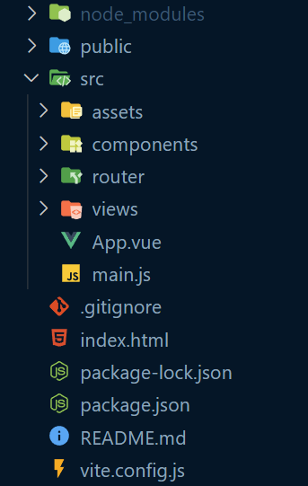

# Tutorial
<!-- https://www.youtube.com/watch?v=rncY1tlWShM -->

## Preequisite

Nodejs should be installed

## Install Vue

```sh
# latest stable
$ npm install vue

# install vue cli
npm install -g @vue/cli
```

## Setup

### Create a new Vue application

```sh
# Create a vue project via the Vue CLI
$ vue create todo-app

# Create a vue project with Vite
$ npm init vue@latest # we will use this
```

### Using Vue from CDN

<!-- braucht man das ? -->

```html
<script src="https://unpkg.com/vue@3/dist/vue.global.js"></script>

```

## Building simple application

<!-- +35min -->

### What you will learn

- Vue Router introduction
- how to use data (reactive data)
- Props
- bind values with v-model and input field ?
- Data-binding
- Methodes
- Computed Properties (is cached for later use)
- Componenten
- v-if/v-for directive
- at last translate options API to composition API

### Step 1: Create new Vue project

```sh
# Create a vue project via the Vue CLI
$ vue create todo-app

# Create a vue project with Vite
$ npm init vue@latest # we will use this
```

Afterwards you need to move into your directory of the newly created project. Either use the explorer or via commands like this.

```sh
# Move into newly created directory
$ cd <project-name>
```

In the project directory you need to install the relevant dependencies for your project to work, for that run on of the following commands.

```sh
# Install the dependencies
$ npm i
# or
$ npm install
```

Now you can start your local development server and view the starter boilerplate.

```sh
# Start up your local development server
$ npm run dev
```

### Setp 2: Explain Project Strucutre

Explain the default project structure.

<!-- +5min -->
<!-- Explain the default project and adjust it  -->
<!-- TODO: mit den Hello world von denen Starten und daraus was bauen dann !! -->



First of all there is the `node_modules` folder which contains all the downloaded packages which are listed in the `package.json` file and thats the location where the these packages are stored when you run the command `$ npm i`. You shouldn't push this folder to a git repository because you will always be able to download them.

The second folder (`public`) only containts a favicon which is the icon you we in the browser tab.

And the third and last folder (`src`) is the main folder were your application lives in.

It containts an `assets` folder which old picture and grahics and more useful assets you will need for your application.

The `components` folder is here to group up special Vue components you build yourself to reuse and seperate your code for a better structure and to seperate your concernces

The `router` folder contains all the information for the Vue Router. I wont discuss this im depth here because the Vue Router library is a whole new topic for itself.

And at last there is the `view` folder which will hold the main views your application will have in the end. For example you will have an Home view or Page, then a page to showcase 404's and maybe errors.

Now that we discuesses what the folders are for, I will quickly go over the files and what they are for.

The `README.md` is hopefully self explainatory. The `vite.config.js` isn't that important because Vite is a JavaScript bundler and there is no need to understand it to work with Vue. It basically tries to bundles all your JavaScript, CSS and more into a more manageable project to use for the browser in the end. Then there is the `package.json` which containts many things including the installed packages. The `package-lock.json` will be created after you have installed (`$ npm i`) the packages which are listed in the `package.json` will be installed in a special version and this will be documented in the `package-lock.json` to be able to recreate a reproducable working system.

Now we will get to the interesting part. In the `index.html` file there are mainly meta informations about the website but it also includes a html `div` element and a referenced `script`. Both are necessary for Vue to be instantiated.

```html
<div id="app"></div>
<script type="module" src="/src/main.js"></script>
```

In the referenced `script` is the following code.

```JavaScript
import { createApp } from "vue";
import App from "./App.vue";
import router from "./router";

const app = createApp(App);

app.use(router);

app.mount("#app");
```

In the first line we import a `createApp(...)` function from Vue itself which is used to create a Vue instance. As a parameter we pass a Vuee file (`App.vue`) which is the main entry of the Vue application and everything will be referenced in here. We will save a reference to our Vue instance with the assignment to the `const app`. With this reference we can later `app.mount(#app)`  the Vue instance on the already existing div element in the `index.html` file.

Now Vue should run and be mounted correctly to the div element. Now we can develop the application inside the `App.vue`.

### Step 3: Clean up the boilerplate code

To create our little sample project we need to clean up the boiler plate project vue+vite generates when you create a new project.

### Step 4: Setup main Vue file

The next step is going is to create a simple navigation bar, with a button which routes us to the home page of the application.

Additionally we also need to create add something to the application which will show the different views of the application

```HTML
<template>
  <header>
    <nav>
      <h1>Simple Album Overview</h1>
      <!-- Routing -->
      <router-link to="/" class="links">List of all Albums</router-link>
    </nav>
  </header>

  <main><router-view /></main>
</template>
```

After we modified the `App.vue` file we will create two more files in the `view` folder. First we have the `HomeView.vue` file and additionally the `PageNotFound.vue` file.

After we created both files with the minimal boiler plate code we will add both pages to the vue router so we can see the routing in action, therefore we need to modify the `index.js` in the `router` folder.

This is the following code which will use both Views.
As a quick explaination, the we pass in the `createRouter(...)` function an object with mainly the possible `routes[...]` array. Each route is an `Object` with specific properties like `name`, `path`, `component` and `meta`.

The `path` is for what url path the following `component` will be shown in the `<router-view />` element.
This also explains the `component` propertie. Here you can either dynamicly import Vue components or staticly import it, in the sample code below you can see both in action.
And the last property I will go over is the `meta` property. In this `Object` we can for example change the website title if we are on this specific url.

```JavaScript
// Vue router components
import { createRouter, createWebHistory } from "vue-router";

// Static import of the Vue Component
import HomeView from "../views/HomeView.vue";

// Vue Router usage
const router = createRouter({
  history: createWebHistory(import.meta.env.BASE_URL),
  routes: [
    {
      name: "404",
      path: "/:pathMatch(.*)*",
      // Dynamic import of Vue Component
      component: () => import("@/views/PageNotFound.vue"),
      meta: {
        title: "404 - Page Not Found",
      },
    },
    {
      path: "/",
      name: "home",
      component: HomeView,
      meta: {
        title: "Albums Overview",
      },
    },
  ],
});

export default router;
```

### Step 5: Setup HomeView Vue File

In the earlier created `HomeView.vue` file we will create some boiler plate HTML code which will creates some strucutre.

In the script part we want to create multiple methodes: `fetch`, `search`, `shuffleAlbums`, and `Remove First Album` from the list. These methodes are created in a `methode: { ... }` Object.

```HTML
<template>
  <div>
    <h1>List all Products</h1>
  </div>

  <form>
    <!-- Two way data binding with input field -->
    <input v-model="query" placeholder="Search a album" />
  </form>

  <!-- Vue Click events -->
  <button v-on:click="removeFirstAlbum">Remove Element</button>
  <button @click="shuffleAlbums">Shuffle Elements</button>

  <!-- Vue Conditional Rendering -->
  <h1 v-if="filteredAlbums.length === 0">Nothing Found</h1>
  <h1 v-else>Found {{ filteredAlbums.length }} Albums</h1>

  <!-- Showcase of TransitionGroup Component from Vue 3 -->
  <TransitionGroup name="list" tag="div" class="list-container">
    <!-- Vue Looping -->
    <!-- Abstract this as a Component -->
      <div v-for="album in filteredAlbums" v-bind:key="album.id">
         {{ album.title }}
      </div>
  </TransitionGroup>
</template>

<script>
// Options API
export default {
  name: "HomeView",
  // these variables can be accessed in the template via their name and inside the script via this.<name>
  data() {
    return {
      albums: [],
      query: "",
    };
  },
  // computed properties are cached and only updated when their dependencies change
  computed: {
    filteredAlbums() {
      return this.albums.filter((album) => {
        return album.title.toLowerCase().includes(this.query.toLowerCase());
      });
    },
  },
  // methods are called like functions
  methods: {
    removeFirstAlbum() {
      this.albums.shift();
    },
    shuffleAlbums() {
      this.albums.sort(() => Math.random() - 0.5);
    },
    async fetchAlbums() {
      fetch("https://jsonplaceholder.typicode.com/albums/1/photos")
        .then((response) => response.json())
        .then((json) => {
          this.albums = json;
          console.log(json);
        });
    },
  },
  // lifecycle hook, called when the component is created
  created() {
    this.fetchAlbums();
  },
};
</script>
```

### Step 6: Use Components & final project

Create new Vue file as a reusable component as AlbumCard and use it in the HomeView in the Vue Loop directive

In the `Homeview.vue` file we would like to abstract the following part into its own component.

```HTML
<!-- Using Components -->
<div v-for="album in filteredAlbums" v-bind:key="album.id">
    {{ album.title }}
</div>
```

This means we will create the `AlbumCard.vue` file in the `components` folder. And we properly add some styling and structuring. But the main thing about components is that we can reuse them easily in many ways. To achive that we can pass values or `props` into the component. In the code snipped below you can see how it is done. This allowes us to import this component into the `Homeview.vue` file and pass the Album down.

This is the `AlbumCard.vue` component

```HTML
<template>
  <div class="list-item">
    
    <div class="list-item-body">
      <p>AlbumID: {{ album.albumId }} and ID: {{ album.id }}</p>
      <h2>{{ album.title }}</h2>
    </div>
  </div>
</template>

<script>
// Options API
export default {
  name: "AlbumCard",
  // Props can be accessed like variables in the template
  props: {
    album: {
      type: Object,
      required: true,
    },
  },
};
</script>
```

But now we need to update the `Homeview.vue` file to properly use the newly created component.

```HTML
<template>

  ...

  <!-- Showcase of TransitionGroup Component from Vue 3 -->
  <TransitionGroup name="list" tag="div" class="list-container">
    <!-- Vue Looping -->

    <!-- Replace this  -->
    <!-- <div v-for="album in filteredAlbums" v-bind:key="album.id">
        {{ album.title }}
    </div> -->

    <!-- for this -->
    <AlbumCard
      v-for="album in filteredAlbums"
      v-bind:key="album.id"
      :album="album"
    >
    </AlbumCard>
  </TransitionGroup>
</template>

<script>
// Importing the AlbumCard component
import AlbumCard from "@/components/AlbumCard.vue";

// Options API
export default {
  name: "HomeView",
  // need to register the component which are in use
  components: {
    AlbumCard,
  },
  ...
};
</script>
```

Now we have finished our small application which showcases how to fetch json data, uses them to create dynamic conent and how work with Vue.js. I know that it is quite the hand full but there is alot more to learn and this is only the beginning of the journey.

I hope you enjoyed the introduction into Vue and you may need to revisit the code the fully understand what append.

## Vue DevTools (optional for development)

It is helpful for debugging and for better understanding but not necessary, but recommendable

- [Vue DevTools](https://devtools.vuejs.org/)

## More Information

- [Vue.js](https://vuejs.org/)
- [Vue Awesome - a list of use thing around Vue](https://github.com/vuejs/awesome-vue)
